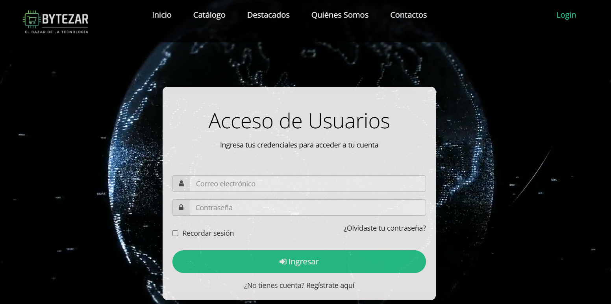
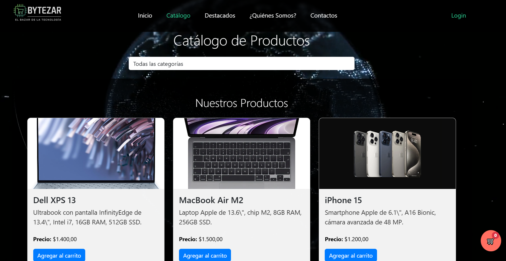
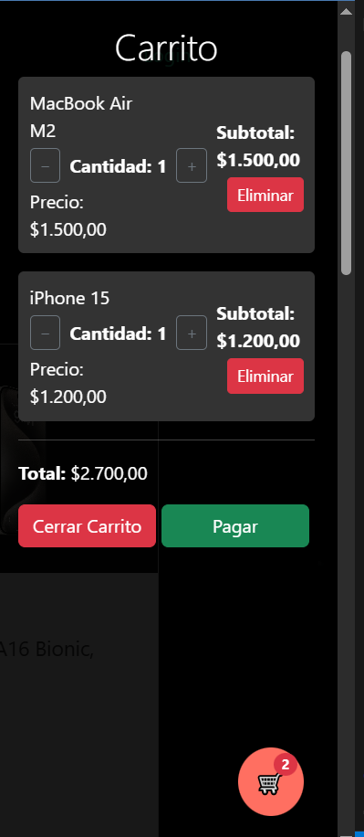
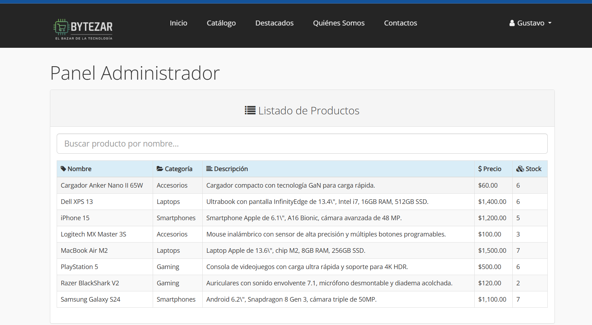

# 🖥️ BYTEZAR - El Bazar de la Tecnología

BYTEZAR es una tienda online de productos electrónicos desarrollada como trabajo práctico colaborativo para la materia **Metodología de Sistemas I** de la **Universidad Tecnológica Nacional - Facultad Regional Resistencia**.

👉 Sitio web desplegado en: [https://bytezar.onrender.com/](https://bytezar.onrender.com/)

---

## 📌 Descripción

BYTEZAR es una aplicación e-commerce que permite a los usuarios:

- Navegar un catálogo de productos electrónicos.
- Registrarse y loguearse como usuarios.
- Agregar productos al carrito.
- Administrar productos (modo admin).
- Realizar compras de manera simple e intuitiva.

---

## 🛠️ Funcionalidades Básicas

### 👤 Autenticación de usuarios

- Registro de nuevos usuarios.
- Inicio de sesión con validación.
- Redirección según tipo de usuario (cliente / administrador).

  

---

### 🛒 Catálogo de productos

- Visualización dinámica de productos con precios, descripciones e imágenes.
- Filtro y búsqueda de productos.



---

### 🏠 Página de inicio

- Presentación de BYTEZAR.
- Acceso rápido al catálogo.
- Enlaces al login y al registro.


---

### 🧾 Carrito de compras

- Agregar, quitar y modificar cantidades de productos.
- Visualización del total.
- Confirmación de compra (checkout).



---

### ⚙️ Panel de administrador

- Agregar, editar o eliminar productos.
- Gestión de usuarios (en futuras versiones).



---

## 🚀 Despliegue local

### 1. Clonar el repositorio

```bash
git clone https://github.com/HackeandoBits/BYTEZAR.git
cd BYTEZAR


## 🧑‍💻 Tecnologías utilizadas

- **Frontend:** HTML, CSS, JavaScript, Bootstrap
- **Backend:** Node.js, Express.js
- **Base de datos:** PostgreSQL
- **Hosting:** Render

---

## 📚 Información académica

- **Materia:** Metodología de Sistemas I  
- **Nivel:** Segundo año (Primer Cuatrimestre)  
- **Docente:** Facundo Leonel Verón  
  - 📧 faccu.veron92@gmail.com  
- **Comisión:** 2.2  
- **Coordinadora de la Carrera:** Ing. Claudia Laclau  
  - 📧 tup@frre.utn.edu.ar  
- 🌐 [www.frre.utn.edu.ar/tup](http://www.frre.utn.edu.ar/tup)

> **Reglamento de Estudio:** Ord. 1622/2018  
> **Diseño Curricular:** Ord. 2018/2023

---

## 🤝 Trabajo Colaborativo

Este proyecto fue desarrollado por estudiantes como práctica pedagógica colaborativa. ¡Gracias por visitarlo y probarlo!

📎 Repositorio: [https://github.com/HackeandoBits/BYTEZAR](https://github.com/HackeandoBits/BYTEZAR)

📍 Demo online: [https://bytezar.onrender.com/](https://bytezar.onrender.com/)
